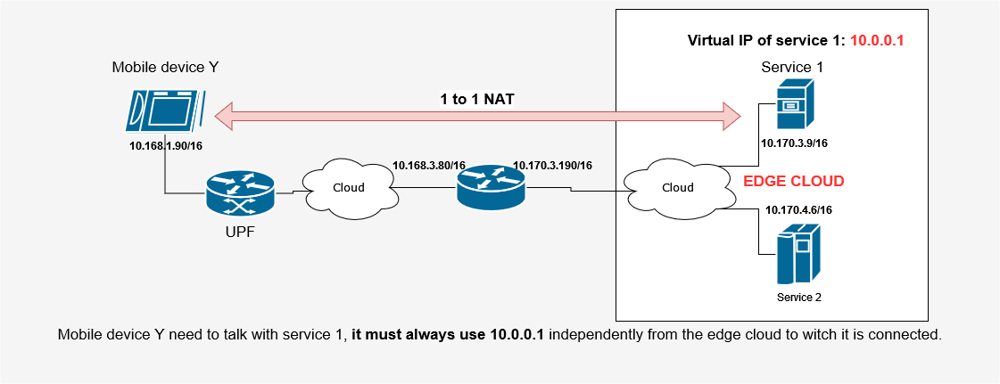

# Vyos Blueprint creation
## Build Vyos image
It is necessary to build directly the Vyos image because the default one is missing some functionalities like DHCP and 
Cloud-init.To build a VyOS image you can use the following instructions.
For additional functionalities, look at the [GitHub](https://github.com/vyos/vyos-vm-images) official page.

0. Create a folder in witch the image will be built and files will be downloaded, enter the folder.
1. Enter the console of a linux machine with docker installed and download the docker file
    ```console
    wget https://raw.githubusercontent.com/vyos/vyos-vm-images/current/Dockerfile
    ```
2. Build local image with name vyos-vm-images (only if you do not have it)
    ```console
    docker build --tag vyos-vm-images:latest -f ./Dockerfile .
    ```
3. Run the docker and connect to the console
    ```console
    docker run --rm -it --privileged -v $(pwd):/vm-build -v $(pwd)/images:/images -w /vm-build vyos-vm-images:latest bash
    ```
4. Now you are using the console inside the container. Clone the repo and enter the folder
    ```console
    git clone https://github.com/vyos/vyos-vm-images.git && cd vyos-vm-images
    ``` 
5. If the MTU is different from 1500 in the network where the image will be used (it happens in OpenStack) you will need to edit 
    the configuration file that will be mounted. 
    ```console
    nano ./roles/install-config/config.boot.j2
    ``` 
    Edit this piece of configuration
    ``` 
    ...
    
        ethernet eth0 {
            address dhcp
        }
    
    ...
    ```
    Such that it becomes
    ```
    ...
    
        ethernet eth0 {
            address dhcp
            mtu 1450
        }
    
    ...
    ```
   
6.  Now you can build the image. Result will be located in `/tmp`
    ```
    sudo ansible-playbook qemu.yml -e enable_dhcp=true -e enable_ssh=true
    ```
7.  Move the image to the mounted folder
    ```
    mv /tmp/vyos-1.5-rolling-.....-10G-qemu.qcow2 /images/
    ```
You should now have the image in the host folder `$(pwd)/images`. The image can be uploaded and used on openstack. 

# Blueprint API usage
## Step 0 - Vyos Creation
> API (POST): *{{ base_url }}/nfvcl/v1/api/blue/VyOSBlue*

- BODY:
```json
{
  "type": "VyOSBlue",
  "areas": [
    {
      "id": 0,
      "config_list": [
        {
          "version": "1.00",
          "admin_password": "vyos",
          "network_endpoints": {
            "mgt": {
              "net_name": "control-os1"
            },
            "data_nets": [
              {
                "net_name": "radio"
              }
            ]
          }
        }
      ]
    }
  ]
}
```
The password can be omitted and by default it's value is ***vyos***.

### VyOS status after creation
An example of VyOS's status after creation should result like this:
```json
"conf":{
    "type": "VyOSBlue",
    "callbackURL": null,
    "areas": [
      {
        "id": 0,
        "config_list": [
          {
            "version": "1.00",
            "name": "K2ZSWQ_vyos_router_area_0_0",
            "nsd_name": "K2ZSWQ_vyos_router_area_0_0",
            "nsd_id": "926454e0-4a79-438d-ae18-9eabd78bd517",
            "network_endpoints": {
              "mgt": {
                "net_name": "mngn-vnf-os",
                "interface_name": "eth0",
                "osm_interface_name": null,
                "ip_addr": "192.168.13.82",
                "network": "192.168.13.0/24"
              },
              "data_nets": [
                {
                  "net_name": "radio_0SJDRI",
                  "interface_name": "eth1",
                  "osm_interface_name": "ens4",
                  "ip_addr": "10.168.3.137",
                  "network": "10.168.0.0/16"
                },
                {
                  "net_name": "radio_test_paolo",
                  "interface_name": "eth2",
                  "osm_interface_name": "ens5",
                  "ip_addr": "10.170.3.74",
                  "network": "10.170.0.0/16"
                }
              ]
            },
            "vyos_router_flavors": null,
            "snat_rules": [],
            "dnat_rules": []
          }
        ]
      }
    ],
    "blueprint_instance_id": "K2ZSWQ",
    "blueprint_type": "VyOSBlue"
  }
```

# Setup NAT rules

### 1 to 1 NAT

- API (PUT): *{{ base_url }}/nfvcl/v1/api/blue/VyOSBlue/{{ blue_id }}/1to1nat*
- Body:
```json
{
  "callbackURL": "",
  "operation": "1to1nat",
  "area": 0,
  "router_name": "K2ZSWQ_vyos_router_area_0_0",
  "rules": [
		{
      "inbound_network": "10.168.0.0/16",
      "virtual_ip": "10.0.0.1",
      "real_destination_ip": "10.170.3.9",
      "source_address": "10.170.3.9",
      "outbound_network": "10.168.0.0/16",
      "rule_number": 16,
      "description": "TEST"
    }
  ]
}
```

### SNAT
- API (PUT): *{{ base_url }}/nfvcl/v1/api/blue/VyOSBlue/{{ blue_id }}/snat*
- Body:
```json
{
  "callbackURL": "string",
  "operation": "snat",
  "area": 0,
  "router_name": "K2ZSWQ_vyos_router_area_0_0",
  "rules": [
    {
      "outbound_network": "10.168.0.0/16",
			"source_address": "10.170.0.0/16",
      "rule_number": 10,
      "description": "Radio_OSJDRI to Radio_test_paolo"
    }
  ]
}
```

### DNAT
- API (PUT): *{{ base_url }}/nfvcl/v1/api/blue/VyOSBlue/{{ blue_id }}/dnat*
- Body:
```json
{
  "callbackURL": "string",
  "operation": "dnat",
  "area": 0,
  "router_name": "K2ZSWQ_vyos_router_area_0_0",
  "rules": [
    {
			"inbound_network": "10.168.0.0/16",
      "virtual_ip": "7.7.7.7",
      "real_destination_ip": "10.170.3.9",
      "rule_number": 1,
      "description": ""
    }
  ]
}
```

# NAT rule deletion
- API (DELETE): *{{ base_url }}/nfvcl/v1/api/blue/VyOSBlue/{{ blue_id }}/nat*
- Body:
``` json
{
  "callbackURL": "string",
  "operation": "del_nat",
  "area": 0,
  "router_name": "8C1R3H_vyos_router_area_0_0",
  "rules": [
    1
  ]
}
```
